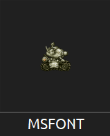

I'm here to assist you, I'll do my best to guide you through the process.

## Running the Program
1. Get the latest release of the program. [Here](https://github.com/VermeilChan/MetalSlugFont/releases)

2. After Installing the program, navigate to your downloads and open the folder named MSFONT.

3. Run MSFONT.exe

4. The program will prompt you to select a font:
   - Choose A Font From 1 To 4.
5. Next, the program will ask you to choose a color:
   - Type 'Blue' for the color Blue.
   - Type 'Orange-1' for Orange 1.
   - Type 'Orange-2' for Orange 2.
6. Once the font and color are selected, the program will ask you to input the text you want to convert to the style of Metal Slug.
7. Enter your desired text and press 'enter'.

## Viewing the Result
- After pressing 'enter', the generated image should appear in your desktop.

And that's pretty much it, I think! If you have any questions or need further assistance, don't hesitate to ask.

Here's my Discord: `mommy_vermeil`.

