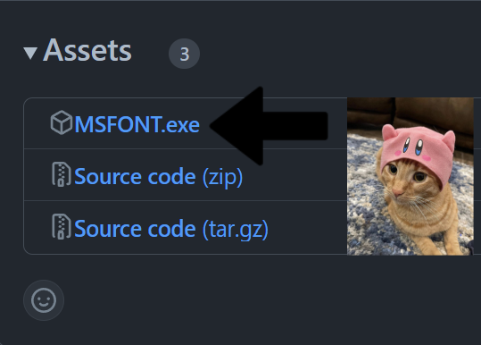

## Running the Program

Follow these steps to use MSFONT:

1. **Download the Program**
   - Download the latest release of the program from the [Releases Page](https://github.com/VermeilChan/MetalSlugFont/releases).

   

2. **Installation and Setup**
   - After installing it, navigate to your downloads and locate the folder named `MSFONT`.
   - Inside the `MSFONT` folder, find and run the `MSFONT.exe` executable.

   

3. **Selecting a Font**
   - Upon running the program, you will be prompted to choose a font.
   - Choose a font by entering a number from 1 to 5.

4. **Choosing a Color**
   - After selecting the font, the available color options will depend on the chosen font.
   - Enter one of the following color options based on the font you've selected:
     - For certain fonts, type `Blue` for the color Blue.
     - For specific fonts, type `Orange-1` for Orange 1.
     - For other fonts, type `Orange-2` for Orange 2.

5. **Input Text**
   - Once you've chosen the font and color, the program will prompt you to input the text you want to convert to the Metal Slug style.

6. **Generating the Style**
   - Enter your desired text and press the 'enter' key.

## Viewing the Result
- After pressing 'enter', the program will generate the stylized text image, which should appear on your desktop.

## Need Help?
If you have any questions or require further assistance, feel free to ask. You can also reach out to me on Discord: `mommy_vermeil`.

