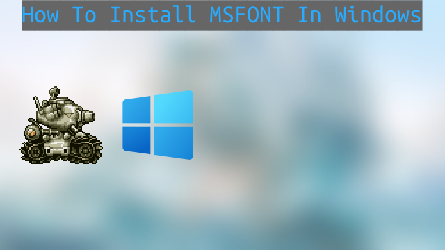
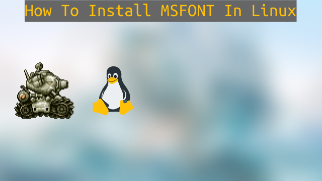

# MetalSlugFont

A tool for creating images with the iconic Metal Slug font.

#### **Note:** The web app is no longer actively maintained, and it might be down at any time. However, if someone cannot use the terminal-based version, I may consider working on it again in the future.

## Table of Contents
- [Features](#features)
- [Preview Fonts](#preview-fonts)
- [Using MSFONT](#using-msfont)
- [Installation](#installation)
- [Contributing](#contributing)
- [License](#license)
- [Credits](#credits)
- [Contact](#contact)

## Features
- Convert text into images with the iconic Metal Slug font.
- Support for Uppercase and Lowercase Alphabets (A-Z, a-z), Numbers (0-9), and Symbols.
  For more information, see [SUPPORTED.md](SUPPORTED.md).

**Note:** The MetalSlugFont may not be compatible with all fonts. Some fonts may lack certain features such as Uppercase and Lowercase Letters (A-Z, a-z), Numbers (0-9), or Symbols.

## Preview Fonts
View examples of generated images with the available fonts in [EXAMPLE.md](EXAMPLE.md).

## Using MSFONT
1. Upon running the program, you will be prompted to choose a font.
2. Choose a font by entering a number from 1 to 5.
3. Once you've chosen your font, the available color options will depend on your selection.
4. Follow the on-screen instructions or refer to the [Setup Guide](GUIDE.md) and [Supported Characters](SUPPORTED.md) for creating Metal Slug font images.
5. Enter one of the following color options based on the font you've chosen:
   - For some fonts, type `Blue` for the color Blue.
   - For specific fonts, type `Orange-1` for Orange 1.
   - For other fonts, type `Orange-2` for Orange 2.
6. The generated image will be saved to your desktop.

## Installation
### Windows

### Linux

**Music track:** [Bread by Lukrembo](https://soundcloud.com/lukrembo/bread)
**Source:** [https://freetouse.com/music](https://freetouse.com/music)
**Free Music Without Copyright (Safe)**

## Contributing
Contributions are highly encouraged! If you encounter issues or have suggestions for improvements, please feel free to [Open An Issue](https://github.com/VermeilChan/MetalSlugFont/issues) or submit a pull request [Pull Request](https://github.com/VermeilChan/MetalSlugFont/pulls).

## License
This project is licensed under the [MIT License](LICENSE).

## Credits
- [Division 六](https://6th-divisions-den.com/)
- [BinRich](https://discord.com/users/477459550904254464)
- [GussPrint](https://www.spriters-resource.com/submitter/Gussprint/)

## Contact
If you have any questions, suggestions, or need assistance, please don't hesitate to contact me:

- **Discord:** [mommy_vermeil](https://discord.com/users/857841811736100925)
- **Twitter:** [@VermeilChan2](https://twitter.com/VermeilChan2)
- **GitHub Issues:** [Project Issues](https://github.com/VermeilChan/MetalSlugFont/issues)
- **Reddit:** [_Vermeil_](https://www.reddit.com/user/_Vermeil_)
- **Stack Overflow:** [Vermeil](https://stackoverflow.com/users/20787000/vermeil)

Feel free to reach out via any of these platforms. I'm most active on Discord and GitHub, so you can expect a quick response there. Whether it's Discord, GitHub Issues, or other social media, I'm here to help and hear your feedback.
