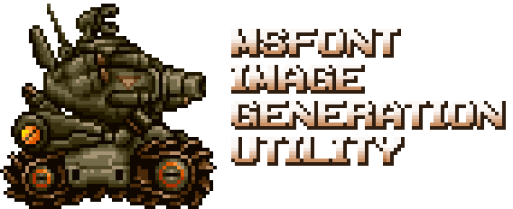
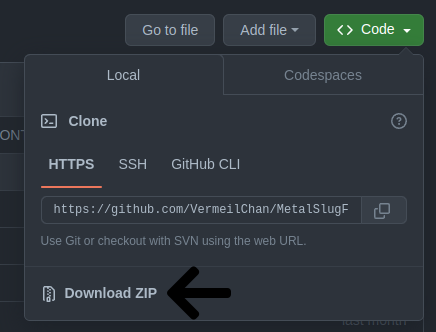
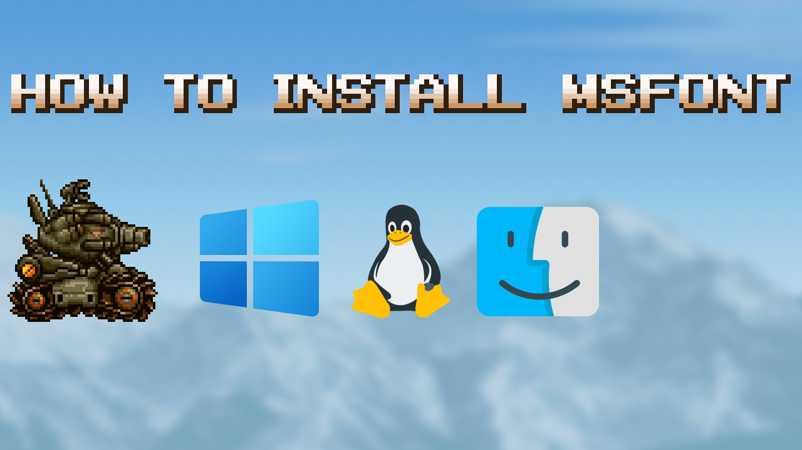

<div style="text-align:center;">
  <h1 style="font-size:2em;">MetalSlugFont</h1>
</div>

<p align="center">
  <a href="https://github.com/VermeilChan/MetalSlugFont">
    
  </a>
</p>

# Program No Longer Maintained

# Thank you for your interest in this project. This program is no longer actively maintained or updated. I recommend using the new and improved version of this software, available at [MetalSlugFontReborn](https://github.com/VermeilChan/MetalSlugFontReborn).

<p align="center">
  <a href="https://github.com/VermeilChan/MetalSlugFont/graphs/contributors" target="_blank">
    
  </a>
  <a href="https://github.com/VermeilChan/MetalSlugFont/releases" target="_blank">
    
  </a>
  <a href="https://github.com/VermeilChan/MetalSlugFont/releases" target="_blank">
    
  </a>
  <a href="https://github.com/VermeilChan/MetalSlugFont/blob/experimental/LICENSE" target="_blank">
    
  </a>
  <a href="https://github.com/VermeilChan/MetalSlugFont/issues" target="_blank">
    
  </a>
  <a href="https://github.com/VermeilChan/MetalSlugFont/pulls" target="_blank">
    
  </a>
  <a href="https://github.com/VermeilChan/MetalSlugFont/commits/experimental" target="_blank">
    
  </a>
</p>

<div style="text-align:center;">
  <h1 style="font-size:2em;">A tool for creating images with the iconic Metal Slug font</h1>
</div>

### **Note:** The web app is no longer actively maintained, and it might be down at any time. However, if the terminal-based version doesn't work for you, you can follow these steps:

1. Download and install Python from the official website (Windows & MacOS): [Python Downloads](https://www.python.org/downloads/).

### Linux

```bash
# Debian/Ubuntu
sudo apt update && sudo apt install python3 python3-pip

# Fedora
sudo dnf install python3 python3-pip

# Arch Linux
sudo pacman -Sy python python-pip
```

2. Download the repository



3. Install the required libraries by opening a terminal or command prompt and navigating to the repository folder. Then, run the following command:

   ```
   pip install -r requirements.txt
   ```

4. Run the program by executing the `terminal.py`:
   
   ```
   python src/terminal.py or python3 src/terminal.py
   ```

## Table of Contents
- [Features](#features)
- [Preview Fonts](#preview-fonts)
  - [Installation](#installation)
  - [Using MSFONT](#using-msfont)
- [Contributing](#contributing)
- [License](#license)
- [Acknowledgments](#acknowledgments)
  - [Contact](#contact)

## Features
- Convert text into images with the iconic Metal Slug font.
  - Support for Uppercase and Lowercase Alphabets (A-Z, a-z), Numbers (0-9), and Symbols.
  For more information, see [SUPPORTED.md](SUPPORTED.md).

**Note:** The MetalSlugFont may not be compatible with all fonts. Some fonts may lack certain features such as Uppercase and Lowercase Letters (A-Z, a-z), Numbers (0-9), or Symbols.

## Preview Fonts
View examples of generated images with the available fonts in [EXAMPLE.md](EXAMPLE.md).

## Installation

For a step-by-step installation guide, you can watch the video tutorial below:

<a href="https://clipchamp.com/watch/Ifs1Azs3ISZ/embed" target="_blank">
 
</a>

## Using MSFONT

1. When you start the program, you'll be presented with a font selection prompt.
2. Choose a font by inputting a number ranging from 1 to 5.
3. Depending on your font selection, the available color options will vary.
4. To create Metal Slug font images, follow the on-screen instructions or consult the [Setup Guide](GUIDE.md) and [Supported Characters](SUPPORTED.md).
5. Input one of the following color options that corresponds to your chosen font:
   - For certain fonts, use `Blue` to specify the Blue color.
     - For particular fonts, use `Orange-1` for Orange 1.
   - For other fonts, use `Orange-2` for Orange 2.
6. The resulting image will be automatically saved to your desktop for easy access. Enjoy using MSFONT!

## Contributing

Your contributions are greatly welcomed and appreciated! If you come across any issues or have ideas for enhancements, please don't hesitate to [open an issue](https://github.com/VermeilChan/MetalSlugFont/issues) or submit a [pull request](https://github.com/VermeilChan/MetalSlugFont/pulls). Your input and involvement help make this project better.

## License
This project is licensed under the [MIT License](LICENSE).

1. **Use:** You can use the software for any purpose, like personal or commercial projects.

2. **Modify:** You can modify the software to suit your needs.

3. **Distribute:** You can distribute the software to others.

4. **No Warranty:** The software is provided "as is," and the author isn't responsible for any issues.

5. **Keep Notice:** You must include the MIT License text and copyright notice in your project.

## Acknowledgments

I would like to express my gratitude to the following individuals and resources for their contributions and support:

- **Division 六:** Assets For Font 1, 2, 3, 4.
- **BinRich:** Providing The Diacritic Marks.
- **GussPrint:** Assets For Font 5.

## Contact
If you have any questions, suggestions, or need assistance, please don't hesitate to contact me:

- **Discord:** [mommy_vermeil](https://discord.com/users/857841811736100925)
- **Twitter:** [@VermeilChan2](https://twitter.com/VermeilChan2)
- **GitHub Issues:** [Project Issues](https://github.com/VermeilChan/MetalSlugFont/issues)
  - **Reddit:** [_Vermeil_](https://www.reddit.com/user/_Vermeil_)
- **Stack Overflow:** [Vermeil](https://stackoverflow.com/users/20787000/vermeil)

Feel free to reach out via any of these platforms. I'm most active on Discord and GitHub, so you can expect a quick response there. Whether it's Discord, GitHub Issues, or other social media, I'm here to help and hear your feedback.
